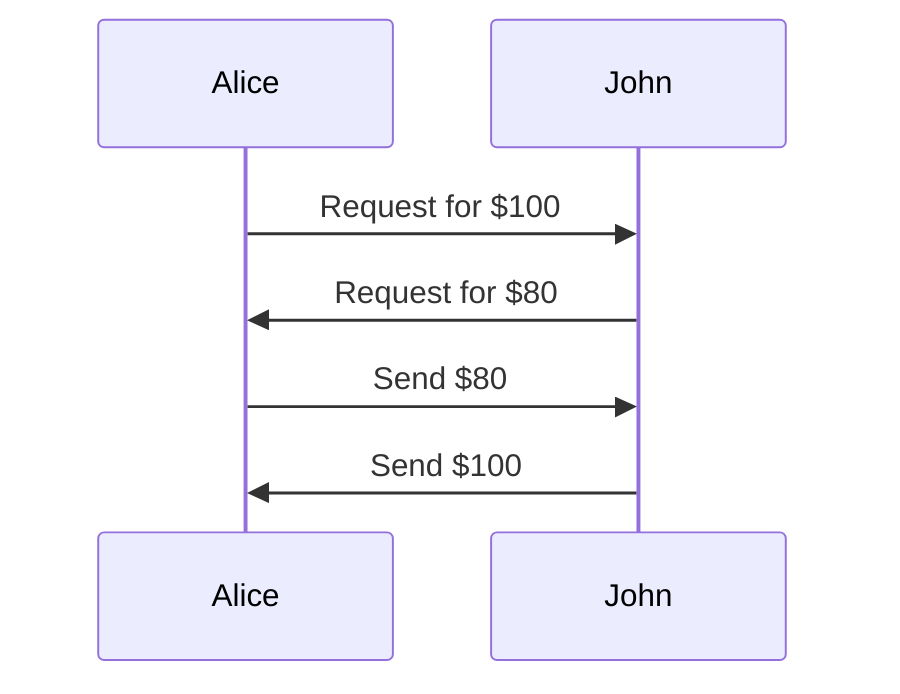
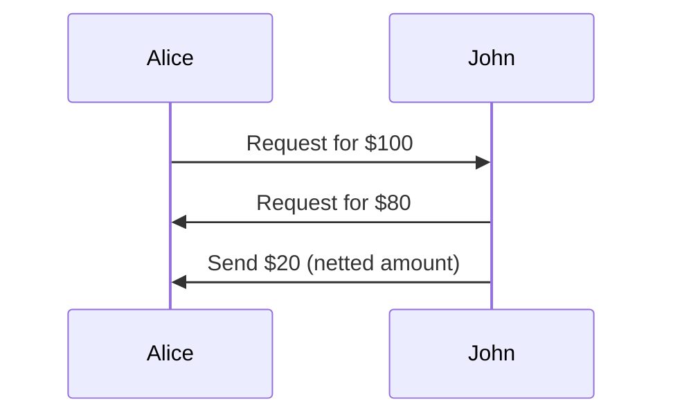
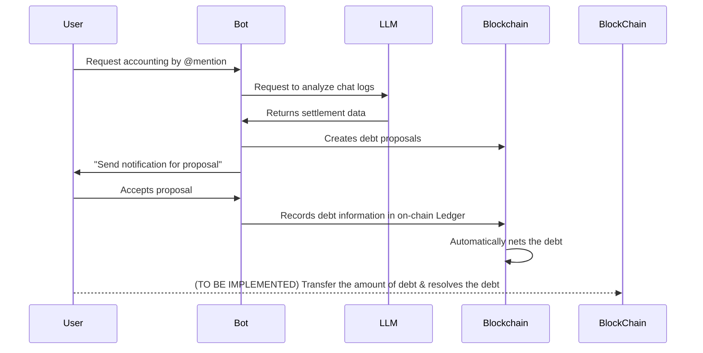

# 🚀 Bill the Accountant: Decentralized Bill Splitting Agent

## 🗂️ Project Overview
- **Student ID:** 20180603
- **Name:** 정승재 (Seungjae Chung)
- **Project Title:** Bill the Accountant - Decentralized Bill Splitting Agent
- **Summary (3–4 sentences):**  
  **Bill the Accountant** is a **blockchain-based bill splitting application** that enables automated, transparent peer-to-peer debt management through Discord conversations. 
  
  Users can discuss expenses naturally (e.g., "I paid $50 for pizza for me, Alice, and Bob") and the bot intelligently process the discussion, then registers debt splits on-chain then receives debtor confirmation for transparency. 
  
  All debts are managed through a on-chain netting system that maintains net balances between user pairs to enable users to send only the eliminated amount for convenience.

---

## 1. 🧩 Problem: What Problem Are You Solving?

**Real-World Problem:**
Traditional bill splitting among friends and groups suffers from several critical inefficiencies:

- **Complex Multi-Party Settlements:** When multiple people owe money to each other, settling becomes mathematically complex and bothersome. (for example, '카카오 정산하기' requires users to send for all bill splitting even though they can be eliminated)
- **Manual Tracking Overhead:** People must manually remember, calculate, and track who owes what to whom across multiple expenses
- **Lack of Transparency:** Existing solutions like Venmo or Splitwise are centralized, creating trust issues and single points of failure
- **Context Loss:** Current systems don't preserve the original conversation context that led to expense agreements
- **Human-Relying Flow:** Existing digital solutions require users to break natural conversation flow to input structured data

**As-is example: Kakao settlement**

**To-be: Bill the Accountant**

**Why This Problem is Worth Solving:**
Bill splitting is a common problem occuring in real live situations, especially for younger generations who eagers to choose cost-effectiveness by sharing expenses with their social connections.
However it is usually a **tricky and bothersome task** which takes time and sometimes sets up controversy, integration of AI agent and blockchain could help clearing up the situation in a short time.

---

## 2. 💡 Solution: Your Proposed Approach

**Core Solution Architecture:**
Bill the Accountant combines three key technologies to create a seamless bill-splitting experience:

1. **LLM-Powered Natural Language Processing:** Uses Google Gemini AI (or it can be any other LLM Model) to analyze chat messages and automatically detect expenses, identify who paid, and determine appropriate participants for bill splitting
2. **Smart Contract Debt Ledger:** Implements sophisticated on-chain debt netting that maintains net balances between user pairs, reducing gas costs and simplifying settlements
3. **Discord Bot Interface:** Provides both automated detection and manual command interfaces, with comprehensive permission handling and error recovery

**How AI & Blockchain are Combined:**

**AI Integration:**
- **Message Analysis:** Gemini AI processes chat history to identify expense-related conversations
- **User Mapping:** Intelligent mapping between Discord usernames and blockchain addresses
- **Context Understanding:** AI determines bill splitting participants based on conversational context (e.g., "we all had dinner" includes everyone mentioned)
- **Expense Extraction:** Automatically parses amounts, currencies, descriptions, and payment responsibilities

**Blockchain Integration:**
- **Propose-Confirm Workflow:** All AI-detected expenses create on-chain debt proposals requiring debtor confirmation
- **Automatic Debt Netting:** Smart contract automatically nets opposing debts between user pairs
- **Immutable History:** Complete audit trail maintained via contract events
- **Multi-Token Support:** Handles ETH, USDC, and other ERC20 tokens with proper decimal precision

**System Workflow:**
1. Users have natural conversations about expenses in Discord
2. AI detects bill-splitting opportunities and maps usernames to blockchain addresses
3. Smart contract creates pending debt proposals on-chain
4. Debtors receive DM notifications with accept/reject options
5. Confirmed debts are automatically netted in the on-chain ledger
6. Users can settle debts directly with ERC20 token transfers (Actually, transfer part should be opt-in to the feature but could not make it in time.)

**Architecture Diagram:** 
<!-- *(Would include visual showing Discord ↔ AI ↔ Smart Contract flow)* -->

---

## 3. 🔗 Why Blockchain (and Token)?

**Why Blockchain is Necessary:**

**1. Immutable Audit Trail:** Traditional bill-splitting apps can modify or delete transaction history. Blockchain ensures permanent, tamper-proof records of all debt agreements and settlements.

**2. Elimination of Intermediaries:** No central authority can freeze accounts, change terms, or extract fees. Users maintain full control of their financial relationships. This also profits by allowing users to send money regardless of the time - for traditional bank accounts, it is impossible to send money near midnight.

**3. Transparent Settlement Logic:** The debt netting algorithm runs on-chain where all parties can verify calculations. No "black box" settlement systems.

**4. Cross-Platform Interoperability:** Debt records exist independently of any single application, enabling future integrations with other platforms or wallets.

**5. Low Transaction Fees:** Modern financial superapps such as KakaoPay and Toss sometimes requires transaction fee (although they are mostly discounted from promotions). Using blockchain and allowing any ERC-20 tokens to be used allows users to exchange money with very low fee.

**Token Strategy:**
The current implementation does **not** use a custom token, instead leveraging existing ERC20 tokens (ETH, USDC) for several strategic reasons:

- **Real Economic Value:** Users can settle debts with tokens that have actual market value
- **No Token Launch Complexity:** Avoids regulatory concerns and token economics design
- **Leverages Existing Stablecoin Payment Rails:** Able to later integrate the stablecoin payment rails such as Coinbase x402
- **Immediate Utility:** Works with tokens users already own
- **Network Effect:** Compatible with existing DeFi ecosystem

---

## 4. 🛠️ MVP or Prototype

- **Current status:**  
  ☑️ Working MVP with core functionality implemented

**Key Features Implemented:**

**Blockchain Infrastructure:**
- Complete smart contract system with propose-confirm workflow and automatic debt netting
- Multi-token support (ETH, USDC) with proper decimal precision handling
- On-chain user registration mapping Discord IDs to wallet addresses
- Comprehensive event system for full transaction history
- Gas-efficient storage design that scales with user pairs, not transaction count

**AI-Powered Automation:**
- Google Gemini AI integration for natural language expense detection
- Intelligent username-to-Discord-mention mapping system
- Automated bill analysis from chat history with user confirmation workflows
- Context-aware participant detection (e.g., "we all" includes mentioned users)
- Bulk debt proposal creation with individual notification system

**Discord Bot Features:**
- Comprehensive command system: registration, manual debt creation, balance checking, transaction history
- Automated wallet creation and funding for new users
- Private key recovery system via DMs for security
- Permission-based error handling preventing bot crashes
- Interactive confirmation system with Discord buttons and modals
- Block explorer integration showing transaction links

**- Code repository:** https://github.com/nuang-ee/bill-the-accountant

**- Screenshots or demo images:**  
*(Placeholder for 2-3 demo images showing:)*
1. *Natural conversation detection and AI analysis*

2. *Discord bot debt proposal interface*

3. *Smart contract interaction and settlement*

---

## 5. 📬 Submission to Hackathons or Grant Programs

Since I marked #1 for the week 5's presentation as [Coinbase x402](https://web3classdao.github.io/kaist2025/reports/x402/), I've skipped the submission.

---

## 6. 🤔 Reflection & Future Work

**What I Learned:**

**Technical Skills:**

Overview: It was a fascinating experience for ramping up knowledges for coding AI agents / prompt engineering / Solidity.
- **Vibe-coding experience using [Gemini CLI](https://github.com/google-gemini/gemini-cli) & [Claude Code](https://www.anthropic.com/claude-code)**:  - It was an amazing experience, could be a perfect tool for making fast MVP & also for learning the platform itself.
- **Advanced Solidity patterns** for gas-efficient storage and complex state management
- **Discord.js bot development** with comprehensive error handling and permission management
- AI API integration and prompt engineering for reliable natural language processing
- TypeScript development for blockchain applications with proper type safety
- Ethers.js v6 for modern Ethereum interactions and event handling

**System Architecture:**
- Designing user-friendly blockchain interactions that hide complexity
- Balancing on-chain transparency with off-chain performance requirements
- Creating robust error recovery systems ~~for production-ready applications~~ (Sadly, I couldn't make it to production-ready state.)
- Implementing propose-confirm workflows that maintain user autonomy

**AI Integration Challenges:**
- Training AI to reliably extract structured data from unstructured conversations
- Handling edge cases in natural language understanding (ambiguous participants, currencies)
- Building user mapping systems that bridge social platforms with blockchain identities

**Biggest Challenges:**

1. **AI Reliability:** Ensuring Gemini consistently produces valid JSON responses and correctly maps usernames to Discord handles required extensive prompt engineering and error handling.

2. **Discord Permission Management:** Implementing comprehensive permission guards to prevent bot crashes while maintaining functionality across different server configurations.

3. **User Experience Flow:** Balancing automation with user control - making the system intelligent enough to detect expenses automatically while requiring explicit confirmation for financial commitments.

**Possible Future Improvements & Next Steps:**

**Short-term:**
- Integrating stablecoin payment rails to fully enable the end-to-end money charge & claim flow
- Enhanced message context storage with Discord message links in debt descriptions
- Multi-currency balance views showing all tokens in single command
- Mobile wallet integration for easier settlement
- Support for more complex expense types (tips, taxes, splits by percentage, splits per menu)

**Long-term:**
- Decentralizing Chatbot & LLM Integration: Currently the AI Agent for NLP & Chatbot server is of centralized implementation. It might be instead integrated to other decentralized AI infrastructures.
- Cross-platform expansion (Telegram, Slack, WhatsApp bots)
- Advanced AI features: receipt OCR, recurring bill detection, spending analytics
- Layer 2 deployment (Polygon, Arbitrum) for lower gas costs
- Web dashboard for comprehensive debt management
- Integrating 3rd party swap systems to enable easy swaps between user's favored token economies

---

## 7. 📚 References

**Related Projects:**
- [Splitwise](https://www.splitwise.com/) - Centralized bill splitting application
- [Request Network](https://request.network/) - Decentralized payment requests
<!-- - [Pool Together](https://pooltogether.com/) - Blockchain-based group savings -->

**Technical Documentation:**
<!-- - [OpenZeppelin Contracts](https://docs.openzeppelin.com/contracts/) - Smart contract security standards -->
- [Discord.js Guide](https://discordjs.guide/) - Discord bot development documentation  
- [Google AI Studio](https://aistudio.google.com/) - Gemini AI API documentation
- [Hardhat Framework](https://hardhat.org/docs) - Ethereum development environment
- [Ethers.js Documentation](https://docs.ethers.org/) - Ethereum library documentation
