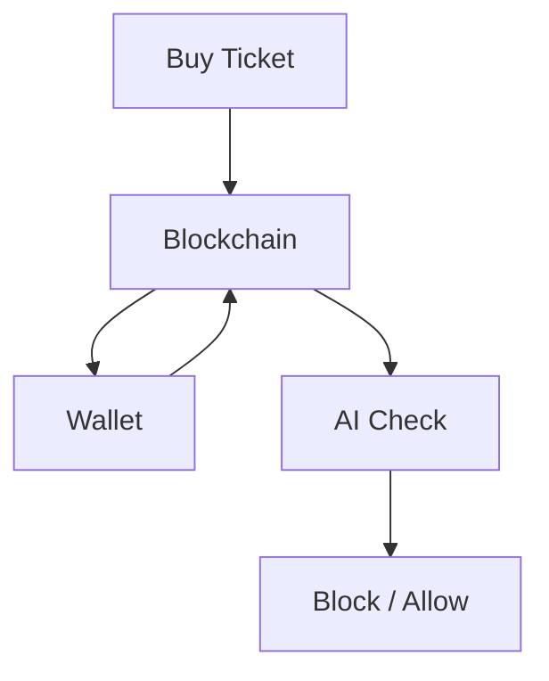

# 🚀 ScalperGuard – AI and Blockchain-Based Ticket Scalping Detection and Prevention System

## 🗂️ Project Overview
- **Student ID:**  20200561
- **Name:**  Junhyeong Jeon
- **Project Title:**  ScalperGuard – AI and Blockchain-Based Ticket Scalping Detection and Prevention System
- **Summary (3–4 sentences):**  
This project addresses illegal ticket reselling by combining blockchain and AI. Tickets are issued as NFTs with built-in resale restrictions, and AI analyzes transaction and activity data to detect suspicious patterns. This dual approach prevents scalping in advance and adapts to new fraudulent behaviors.

---

## 1. 🧩 Problem: What Problem Are You Solving?

  
  

Illegal ticket reselling, or **scalping(암표 거래)**, has become a major issue in online ticket markets. Scalpers use automated tools and bulk-purchase tactics to buy large volumes of tickets at face value, then resell them at highly inflated prices. This practice not only limits access for genuine fans but also undermines fairness and trust in event ticketing systems.

### Limitations of Existing Solutions
- **Centralized control**: Most current ticketing platforms rely on internal monitoring systems, which can be bypassed by advanced scalping bots.
- **Weak resale restrictions**: Price caps or resale limits are often enforced off-chain, making them easier to evade or manipulate.
- **Reactive detection**: Traditional fraud detection is performed after suspicious transactions occur, which means damage is already done before intervention.

### Why This Problem is Worth Solving
- **Fair access**: Ensuring that tickets reach real fans at fair prices improves the overall event experience.
- **Market trust**: Transparent and enforceable rules can restore user confidence in online ticket sales.
- **Scalability**: A robust, automated system that combines blockchain and AI can be applied to various event industries, from concerts to sports, without relying solely on manual oversight.

---

## 2. 💡 Solution: Your Proposed Approach

The proposed solution, **ScalperGuard**, is a hybrid system that integrates **Blockchain** for transparent, tamper-resistant ticket issuance and **Artificial Intelligence (AI)** for adaptive fraud detection. The system is designed to address ticket scalping in both **preventive** and **detective** stages.

### How the Solution Works
1. **Preventive Layer – Blockchain Smart Contracts**
   - Tickets are issued as **NFTs (Non-Fungible Tokens)** on a blockchain network.
   - Smart contracts enforce programmable rules:
     - **Cooldown Periods**: Restrict transfers within a set time after purchase.
     - **Resale Price Caps**: Limit resale prices to a fixed percentage above face value.
     - **KYC/Proof-of-Personhood (PoP)**: Require verified identities for ticket ownership and transfer.
     - **Transfer Limits**: Limit the number of resales per ticket.
   - These rules are enforced automatically and cannot be bypassed without triggering an on-chain failure.

2. **Detective Layer – AI-Based Scalper Detection**
   - AI models analyze **on-chain transaction data** (e.g., transfer frequency, wallet connections) and **off-chain activity logs** (e.g., login patterns, IP/device data).
   - Features such as transaction velocity, abnormal resale pricing, and suspicious wallet clustering are extracted.
   - Anomaly detection algorithms (e.g., Isolation Forest) and graph analysis identify high-risk wallets.
   - Each wallet is assigned a **risk score**, with actions ranging from warnings (soft block) to transaction restrictions (hard block).

3. **Enforcement & Feedback**
   - High-risk wallets are flagged for review or automatically restricted.
   - Feedback from detection outcomes is used to improve the AI model, adapting to evolving scalping strategies.

### How AI & Blockchain Are Combined
- **Blockchain** ensures rule enforcement at the infrastructure level (immutability, transparency, trustlessness).
- **AI** augments blockchain with adaptive detection, identifying scalpers who operate within allowed limits but still show suspicious behavior.
- The integration creates a **closed-loop system**:
  1. Blockchain prevents most illegal actions outright.
  2. AI catches edge cases and evolving attack patterns.
  3. Detected cases inform contract policy updates.

### System Architecture Diagram

---

## 3. 🔗 Why Blockchain (and Token)?

### Why Blockchain is Necessary
Blockchain ensures that all ticket transactions are **transparent**, **tamper-proof**, and **verifiable** by anyone.  
Once a ticket is issued as an NFT, its ownership history and transaction details are permanently recorded on-chain.  
This eliminates the possibility of hidden trades, fake tickets, or backdoor price manipulation.

### Problems Blockchain Solves in This Context
- **Fraud Prevention**: Stops duplicate or counterfeit tickets by enforcing unique, verifiable tokens.
- **Rule Enforcement**: Smart contracts automatically apply cooldowns, price caps, and KYC/PoP checks without relying on centralized intervention.
- **Transparency**: Every transaction is visible, making scalper patterns easier to detect.
- **Interoperability**: Tickets can be verified across multiple platforms without depending on one company’s database.

### Token Design and Purpose
In this system, the “token” refers to the **NFT ticket** itself rather than a fungible cryptocurrency.  
Each ticket NFT contains metadata such as:
- Event ID, seat, and price
- Policy parameters (cooldown time, max resale price)
- Current and past owners

**Purpose**:
- **Proof of Ownership**: Verifies that a user legitimately owns the ticket.
- **Policy Container**: Holds rules that are enforced automatically on transfer.
- **Traceability**: Makes it easy to audit ticket history and detect abnormal transfers.

### Why No Separate Fungible Token
A separate ERC-20 or similar fungible token is not used because:
- The system’s core value lies in secure ticket transfers, not in incentives or governance.
- Introducing a tradeable token would add unnecessary complexity and potential speculation unrelated to the ticketing function.

---

## 4. 🛠️ MVP or Prototype

- **Current status:** ☑ Prototype  
  The current build functions as a **proof-of-concept prototype** demonstrating the integration of AI-powered anomaly detection with blockchain-based activity logging. While it is not yet production-ready, the core architecture and essential features are implemented and testable in a development environment.

### Key Features Implemented
The prototype includes:
1. **AI-based Activity Analysis** – The system processes user activity logs (e.g., login patterns, device info) and detects anomalies that may indicate suspicious behavior.  
2. **Blockchain Logging** – Verified activity data is stored on-chain to ensure immutability and transparency.  
3. **Smart Contract Enforcement** – Basic smart contracts enforce verification rules and record proof of authenticity without exposing sensitive raw data.  
4. **Web-based Interface** – A minimal interface allows users to upload data, run AI checks, and view blockchain verification results.

The implementation focuses on demonstrating **feasibility** rather than full optimization or user experience. It serves as a solid foundation for scaling into a working MVP.

- **Code repository:** *[ScalperGuard.git](https://github.com/muchwater/ScalperGuard.git)*  
- **Screenshots or demo images:**  
  Mint token(ticket) and Simulate Scapling
  
  
  AI Analysis result 
  

  AI Analysis result (zoomed)
  

---

## 5. 📬 Submission to Hackathons or Grant Programs
- Name of the program: Onchain Summer Awards
- Submission link: [ScalperGuard](https://devfolio.co/projects/scalperguard-5bbb)
- ScalperGuard is a prototype system that combines blockchain-based NFT ticketing with AI-powered anomaly detection to prevent and detect ticket scalping. It enforces resale rules through smart contracts and identifies suspicious trading patterns to protect fair ticket access.

---

## 6. 🤔 Reflection & Future Work

### What I Learned
Through this project, I gained hands-on experience in **integrating AI with blockchain** to address a real-world problem.  
I learned how blockchain’s immutability and transparency can enhance trust in systems where fraud prevention and verification are critical.  
Additionally, I explored how smart contracts can automate policy enforcement without central control, and how AI can be used to detect abnormal activity patterns.

### Biggest Challenges
- **Smart Contract Logic**: Designing contracts that enforce rules (cooldowns, price caps) while remaining flexible for different events was more complex than expected.
- **AI–Blockchain Data Bridge**: Ensuring seamless communication between the AI system and blockchain data was challenging, especially when parsing on-chain logs for analysis.
- **User Accessibility**: Balancing blockchain’s technical complexity with the need for an easy user experience required careful design.

### Future Improvements
1. **Enhance AI Models**: Improve anomaly detection accuracy by incorporating more behavioral data and fine-tuning models.
2. **Multi-Chain Support**: Allow tickets to be issued and verified across multiple blockchain networks for broader accessibility.
3. **User-Friendly Wallet Integration**: Simplify blockchain interaction by embedding custodial wallet options for non-crypto users.
4. **Dynamic Policy Updates**: Develop mechanisms to adjust resale rules dynamically based on demand, season, or event organizer input.

---
## 7. 📚 References

- [Haryadi, G. A., Zainudin, A., Lee, J. M., & Kim, D.-S. (2025). *PureNFT: A Blockchain-Based Ticketing System with Lightweight AI for Scalping Prevention*.](https://www.researchgate.net/publication/390217245_PureNFT_A_Blockchain-Based_Ticketing_System_with_Lightweight_AI_for_Scalping_Prevention)
- [Aventus creates blockchain platform to end scalping and fake tickets. Coin Rivet. (2018).](https://coinrivet.com/aventus-creates-blockchain-platform-to-end-scalping-and-fake-tickets/)
- [Blockchain in Event Ticketing to Prevent Fraud: GenX AI's Blueprint for a Secure Entertainment Experience. Medium. (2024).](https://medium.com/@genxaiblogs/blockchain-in-event-ticketing-to-prevent-fraud-genx-ais-blueprint-for-a-secure-entertainment-0b267cb974c7)

