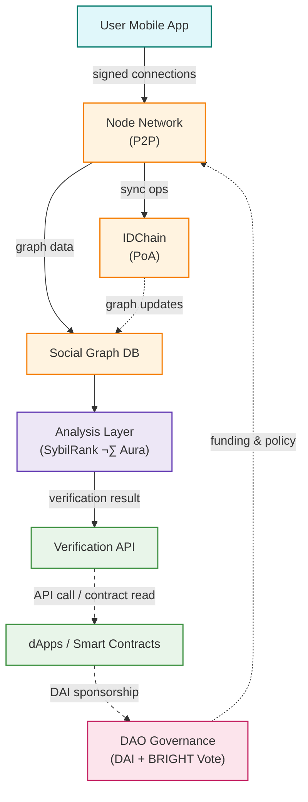

# 📄 BrightID  
- 👤 Author: [20200561 / Junhyeong Jeon](https://github.com/muchwater)
- 📆 Presentation Date: [2025-07-30]  

---

## 1. Overview

- **Project Name**: BrightID  
- **Category**: Proof of Personhood & Identity  
- **Key Technologies / Platforms**: Social Graph Analysis, IDChain (Proof-of-Authority EVM sidechain), Ethereum, IPFS, Aura Anti-Sybil Algorithm  
- **Official Links**:
  - [Website](https://www.brightid.org)
  - [Foundation](https://www.brightid.org/about) 
  - [Contract Address] : [0x5dd57da40e6866c9fcc34f4b6ddc89f1ba740dfe](https://etherscan.io/address/0x5dd57da40e6866c9fcc34f4b6ddc89f1ba740dfe) (Etherium)
  - [Whitepaper](https://www.brightid.org/whitepaper)
  - [Docs](https://brightid.gitbook.io/brightid) 
  - [GitHub](https://github.com/BrightID) 
  - [X](https://twitter.com/BrightIDProject)
  - [Discord](https://discord.gg/brightid-596752664906432522)

### üìå Summary  
BrightID is a decentralized social identity network designed to address the problem of Sybil attacks, where a single person attempts to create multiple accounts. Without relying on centralized real-name verification, BrightID enables users to prove their uniqueness by building a social graph based on peer-to-peer connections and analyzing these relationships for verification.

The project maintains graph synchronization through IDChain, an Ethereum-based chain, and offers open-source analysis tools so that anyone can apply their own verification logic. It also enhances both user experience and security through features such as a mobile app, seed groups, primary groups, and social recovery.

BrightID has already been integrated into various decentralized applications (dApps) and supports sustainable operation through user sponsorships and DAO-based governance. By doing so, it provides a trustworthy identity infrastructure within decentralized environments, demonstrating its potential as a digital public good.

---

## 2. Background & Problem Statement

### Problem  
In digital environments, Sybil attacks—where a single user creates multiple accounts to receive duplicate rewards or manipulate votes and airdrops—are common. BrightID is designed to analyze the social graph and prove to dApps that a user holds only one unique identity. This allows applications to safely enforce the principle of "one person = one account."

### Centralized Approach Limitations  
Traditional centralized KYC and OAuth methods pose several challenges: risk of hacking and privacy violations due to personal data centralization, potential for internal misconduct or censorship by single trusted entities, and a lack of interoperability across national or platform boundaries. BrightID overcomes these issues by ensuring that data is shared only between parties and by making both verification logic and social graphs decentralized and open source.

### AI Relevance  
In the era of Web3 and AI, token-based incentives power systems like decentralized AI infrastructure, AI payment rails, and data marketplaces. If Sybil attacks are left unchecked, they can distort AI contribution reward mechanisms through bots, degrade the quality of crowdsourced data, and manipulate AI governance votes.

The Sybil-resistant identity layer provided by BrightID is essential for improving the quality of human-labeled data, ensuring fair token distribution, and securing the reliability of training data for AI models. As the AI ecosystem expands, BrightID’s value becomes increasingly vital.

---
## 3. How It Works

### üîç 3.1 Project Approach  
BrightID builds a trust-based social graph and analyzes it to prove that a user is a unique, real individual. This is the core strategy for addressing the Sybil attack problem defined in Section 2.

#### Core Idea  
The central premise is that "trust comes not from a central authority, but from human connections." BrightID allows users to form direct connections with people they know, and calculates trustworthiness based on the decentralized social graph formed by these connections. Each user can sign their connections with their own private key, thereby proving trusted relationships themselves and presenting their proof of uniqueness to various applications.

#### Approach & Process  
Users create connections with others through the BrightID app. These connections are stored as cryptographically signed data and managed locally using the user's key. All connections are synchronized via IDChain, a Proof-of-Authority blockchain built on Ethereum. Independent verification nodes run Sybil analysis algorithms (e.g., SybilRank, Aura) on the graph. The results of these analyses are used to determine whether a user is unique, and applications can verify this via API calls to BrightID.

#### Difference from Existing Methods  
Unlike traditional KYC (ID verification), certificate-based systems, or OAuth (central login services), BrightID is unique in the following ways:
- **Decentralization**: The connection graph is synchronized peer-to-peer without a central server.  
- **Self-Sovereignty**: Users own their identity and connection data directly.  
- **Privacy Protection**: Names and photos are not stored on any server and are only shared with connected users.  
- **Flexible Verification Algorithms**: Each node can apply its own algorithm and criteria, enabling open innovation and a multi-verification system.

---
### 🏗️ 3.2 Architecture  

#### Key Components  
- User Mobile App  
- Signing Keys & Connections  
- P2P Node Network  
- Social Graph Database  
- IDChain (EVM-compatible PoA chain)  
- Analysis Layer (SybilRank, Aura)  
- Verification API Gateway  
- Smart Contracts (DAI Sponsorship, Verification)  
- dApps / Integrations  
- DAO Governance (via BRIGHT ERC-20)

#### Data Flow Explanation  
Users create connections with others through the Mobile App. Each connection is signed with the user's private key and stored locally. The signed information is propagated through the P2P Node Network, where each node synchronizes the Social Graph Database based on this data. Updates to the graph are recorded on IDChain, an EVM-compatible Proof-of-Authority blockchain, ensuring data immutability.

All nodes periodically execute Sybil analysis algorithms such as SybilRank and Aura in the Analysis Layer to assess the uniqueness of users based on the graph structure. The analysis results are cached in the Verification API Gateway, and external dApps can verify the user’s identity status (verified/unverified) via REST/GraphQL calls or smart contract queries.

When a dApp onboards a new user, it can pay 1 DAI through the DAI Sponsorship Contract to keep the user in a verified state for a certain period. Sponsorship revenue flows into the DAO treasury and is used to fund node operation, analysis research, and seed group development. The DAO governs this treasury using BRIGHT tokens, which serve as governance tokens for voting—not for circulation or rewards.

#### Architecture Diagram  
> As no official diagram was found in the documentation, this diagram was created manually.

---
### 🎯 3.3 Core Components  

- **Social Graph & IDChain**  
The foundational data structure of BrightID is the social graph, composed of signed connections between users. Each user signs their connections using their private key, and the graph is shared across the P2P Node Network. All changes to the graph are recorded as transactions on IDChain, an Ethereum-based Proof-of-Authority chain, ensuring a consistent and tamper-resistant state across all nodes.

- **Analysis Layer**  
Nodes periodically analyze the social graph to calculate each user's uniqueness score. Core algorithms include SybilRank and Aura, an anti-Sybil model developed by the BrightID team. Each node may define its own threshold to balance false positives and false negatives.

- **Mobile App & Social Recovery**  
The mobile app supports account creation, QR-based connections, group management, and key backup, making network participation intuitive. During connection, users can view real-time data such as the partner's join date, mutual connections, and verification status—helping to identify Sybil behavior early. If a user loses their private key, they can securely recover their identity by reconnecting with two pre-designated contacts through a social recovery process.

- **Sponsorship & BRIGHT Token Economics**  
Each user must be sponsored once in their lifetime, which involves a dApp paying 1 DAI to permanently verify the user. This payment is managed via BRIGHT ERC-20 token accounting and is used to fund operations, research, and seed group development. Sponsorship volume also ranks participating dApps, encouraging ecosystem engagement. Any surplus revenue is redistributed to all verified users.

- **BrightID Main DAO**  
The BrightID Main DAO is built on Aragon and IDChain, and governs the allocation of budgets for development, research, and community support. It distributes governance rights to dApp and community delegates based on sponsorship metrics, ensuring decentralized and transparent decision-making.

---

### 🔁 3.4 Workflow Overview  

1. **Create Connection** – Users exchange QR codes via the Mobile App to generate a signed connection.  
2. **Graph Synchronization** – New connections are propagated via P2P nodes and permanently recorded on IDChain.  
3. **Uniqueness Analysis** – Nodes analyze the social graph and update each user’s uniqueness score.  
4. **dApp Verification** – dApps query the user’s uniqueness status through the Verification API or smart contract.  
5. **Sponsorship Payment** – During initial verification, a dApp pays 1 DAI to sponsor the user, and the DAO reinvests the revenue into the ecosystem.

---
## 4. Token Economy

BrightID does not use tokens for its identity verification system; Sybil resistance is achieved purely through analysis of the social graph.

However, a separate BRIGHT token exists solely for governance within the BrightID ecosystem DAO. The operational funding model is based on DAI sponsorships, and there is no token-based incentive mechanism implemented.

---

## 5. Project Status & Plan

### Current State  
Since its beta release in 2019, BrightID has reached the **production stage**. As of July 2025, there are over **100,000 verified unique users** and **15 dApps** (e.g., Gitcoin Passport, CLR.fund) that have integrated BrightID as a Sybil-resistance layer.

### Developer & Open-Source Activity  
- Mobile app repo: <https://github.com/BrightID/BrightID>  
- Over 30 sub-repositories for core nodes, graph explorers, etc., are publicly maintained under the ISC license with ongoing weekly issues and pull requests.

### Partnerships & Funding  
- Received an **Aragon Nest Grant** (Aug 2018 — $90,000 USD + 15,000 ANT) for initial development.  
- Raised over $250k USD in community funding, including **$200,000 from Optimism RetroPGF** and **$50,000 from Gitcoin Grants** in 2024.  
- Currently expanding use cases through integrations with Web3 projects like Gitcoin Passport, Unitap, and Orange Protocol.

### Roadmap (H2 2025)  
- Launch of **Aura Beta 2** to migrate dApps from the old “meets” model to Aura scoring  
- Integration of **Ethereum Attestations** to support diverse on/off-chain proof formats  
- Improve onboarding UX with **Known Identifier Tool** and **Find-Aura-Player** features  
- Simplify the **Sponsorship Flow** and refactor **P2P coordination** between nodes

### Reality Check  
BrightID has moved beyond the idea stage, supported by **real-world metrics (100k+ users, 15 apps)**, **active open-source contributions**, and **multiple community grants**. However, due to low token liquidity and limited participation from major VCs, **network effects and commercial scale** are still in the early stages of growth.

---
## 6. User Experience & Hands-on Review *(if applicable)*

### BrightID Application  
BrightID is available as an iPhone or Android application, as shown below.  

Upon launching the app, a screen for account creation appears. After creating an account, the user is directed to the main dashboard.  

  
  

 

Below is the main screen of BrightID. It displays profile information, current connections, achievements, and connected apps. At the bottom, users can see buttons for “My Code” and “Scan a Code” to connect with others.  
> Note: A connection is already shown in the screenshot due to a missed capture during the initial stage. Normally, the app starts with zero connections.  
 

### Connecting with Other BrightIDs  
Using a separate device, I created three additional BrightID accounts and connected them. When you tap the “My Code” button, a temporary QR code is generated, as shown below.  

When another user scans the QR code, both parties can select how well they know each other.  

  
  

 

The lowest selected level of familiarity between the two users becomes the actual connection value. Below are examples of various connection types.  

### Recovery Connections  
BrightID does not rely on centralized credentials such as usernames or passwords. This means that users cannot recover their accounts using traditional credentials. Instead, BrightID uses a decentralized method called **Recovery Connection**.

Recovery Connections allow users to restore their accounts by reconnecting with trusted BrightID users. To configure this, users must first establish connections with at least three “Already Known” accounts. Once this condition is met, users can designate certain connections as Recovery Connections.

  
  

### dApps  
BrightID enables uniqueness verification, preventing Sybil attacks (i.e., one person creating multiple accounts), making it a valuable identity layer for various decentralized applications (dApps).

For example, Gitcoin uses BrightID as a requirement to participate in Quadratic Funding. Other Web3 services such as Eidi Faucet also adopt BrightID to ensure that each user is a unique individual.

When a user connects BrightID to a dApp, the dApp may register the user under a Sponsorship status. Most dApps require users to achieve a certain verification score before allowing sponsorship. To meet this requirement, users must either attend an official BrightID Meet session or build numerous social connections with verified users.

 
Since BrightID Meet sessions are not held regularly, this document shows only the basic steps for connecting BrightID to dApps.  

  
  

### BrightID Explorer  
BrightID Explorer is a web-based tool that allows users to view connection statuses and verification scores within the BrightID network. It provides a visual interface for exploring the number of connections per user, their positions within the social graph, and the structure of connections between nodes. It also indicates whether a user is verified or unverified. This tool is primarily used by developers and dApp operators to evaluate user trust levels or analyze the Sybil-resistant structure of the system. BrightID Explorer requires no login and can be accessed by anyone via a user’s unique ID or a QR-based link.  
  

### User Feedback  
- Despite being a core identity verification system, the app had numerous GUI-level bugs, suggesting that it still feels like a work-in-progress.  
- Suppose User A marks User B as "Already Known", and B marks A as "Just Met". While A is not informed of B’s choice in the app (they only see “Already Known”), the true mutual connection level can be revealed through the verification process or the explorer. This reflects a limitation of decentralized systems—lack of visibility over the other party’s settings—and raises concerns about potential privacy leakage.  
- Many technical terms were used throughout the app, making it difficult for general users to navigate. There is a need to simplify terminology for broader accessibility.

---

## 7. Why Blockchain

- **Overcoming the Limits of Centralized Sybil Defenses**  
  The problem BrightID addresses—individuals creating multiple accounts to receive duplicate rewards—is prone to abuse if verification authority is centralized. BrightID adopts the principle that **"it should not be controlled by a single centralized organization"**, making blockchain-based decentralization a core design requirement.

- **Full Replication & Multi-Algorithm Verification**  
  The social graph is **fully replicated across all nodes**, and blockchain immutably records all changes. This allows independent research teams or communities to run **their own anti-Sybil algorithms** in parallel and cross-validate results. Even if one analysis model fails, the network as a whole remains secure.

- **IDChain: Immutability & Auditability**  
  All changes to connections are recorded as transactions on **IDChain**, an Ethereum-based Proof-of-Authority blockchain. This enables anyone to trace and audit the origin and timestamp of verification results, eliminating the risk of tampering or forgery.

- **Privacy-Preserving Self-Sovereign Identity (SSI)**  
  Users sign connections with their private keys and retain ownership of their data. The blockchain stores only minimal metadata (e.g., hashes, connection events), while personal information (e.g., real names, photos) is exchanged off-chain via P2P—ensuring GDPR-level privacy protection.

- **Public Goods Governance & Transparent Funding**  
  The 1 DAI sponsorship fee flows into a **DAO treasury (smart contract)** and is transparently allocated. Budget and accounting records are publicly available on-chain, enabling global community governance at lower overhead than traditional foundations or trusts.

---
## 8. Insights & Limitations

### ‚úÖ Key Takeaways  
- **Deployed Proof-of-Uniqueness via Social Graphs**  
  BrightID successfully implemented proof-of-uniqueness using peer-to-peer connection data transparently recorded on **IDChain** and analyzed through multiple algorithms like **SybilRank** and **Aura**. It demonstrates how **privacy protection** and **Sybil resistance** can be achieved simultaneously in blockchain-based reward systems.  

- **Lightweight Economic Model Minimizes Network Overhead**  
  Instead of relying on complex token inflation, BrightID sustains its DAO budget solely through a **1 DAI sponsorship fee**, separating governance power (BRIGHT) from the revenue stream (DAI). This results in a predictable cost structure and reduces dependency on volatile token prices.

- **Mobile-First Self-Sovereign Identity (SSI) UX**  
  The entire user journey—from registration to recovery (via Social Recovery)—is handled through **mobile QR interactions**, lowering the barrier for Web3 newcomers. From a privacy standpoint, data like names and photos are exchanged only via P2P and never stored on servers, meeting **GDPR-grade minimization standards**.

### ‚ö† Limitations / Open Questions  
- **Difficult to Achieve Initial Network Effects**  
  The accuracy of Sybil detection depends on connection density and Seed Group distribution. In new regions or communities, a lack of “Strong Connections” can result in **verification delays** (ranging from minutes to hours) and a higher risk of **false negatives**.

- **Gap with Legal KYC Requirements**  
  In regulated sectors like finance and exchanges, **real-name verification** is mandatory. Since BrightID only proves uniqueness, it cannot replace legal KYC and faces challenges in **regulatory compatibility with Web2 services**.

- **Need to Validate the Sustainability of the Funding Model**  
  If the user base grows significantly or the value of DAI drops, the **1 DAI sponsorship fee** may not be sufficient to fund node operations, research, and community grants. Potential solutions include adjusting the fee or introducing new revenue streams (e.g., premium analytics APIs).

- **Low Liquidity of BRIGHT Tokens**  
  BRIGHT currently has limited trading volume, which makes DAO participation less accessible. If token concentration increases, there is a risk of **governance capture**. Expanding token distribution or designing a staking-based incentive system may be necessary in the future.

## Added by Jason

>**ChatGPT Prompt: What are the advantages and insights of BrightID over methods that require user biometrics or KYC information, such as World ID, Humanity Protocol, Human Passport, etc.?**

### üåê Advantages and Insights of BrightID Compared to Biometric/KYC-Based Identity Systems

BrightID differs from systems like **World ID**, **Humanity Protocol**, and **Human Passport**, which rely on **biometric data** or **KYC (Know Your Customer)** information. Instead, BrightID uses a **social graph-based** approach to prove personhood and uniqueness. This offers several compelling advantages and philosophical insights:

---

### ‚úÖ Key Advantages of BrightID (vs. Biometric/KYC Systems)

### üîê 1. Privacy Protection
- BrightID does **not collect biometric data** (like iris or facial scans) or official government-issued documents.
- This reduces **risk of data leaks** and allows users to **prove uniqueness without revealing identity**.

> üå± **Insight**: Proving that you're human doesn't require sacrificing anonymity.

---

### üß© 2. Inclusive and Borderless Access
- KYC systems require access to national IDs, passports, or banking systems.
- BrightID allows participation **without nationality, ID, or documentation**.

> üåç **Insight**: A decentralized identity system should be universally accessible, not institutionally gated.

---

### üí∏ 3. Low Cost and Minimal Infrastructure
- Biometric verification needs **specialized hardware and centers**; KYC involves **legal/administrative overhead**.
- BrightID only requires a **smartphone and social connections**, making it **lightweight and accessible**.

> üì± **Insight**: Identity infrastructure can be built from tools people already have.

---

### 🧠 4. Decentralized and User-Controlled
- KYC/biometric systems rely on **central authorities or organizations** (e.g., governments, Worldcoin Foundation).
- BrightID uses **peer-to-peer verification** and **does not require a central certifier**.

> 🕸️ **Insight**: Trust can be decentralized socially, not just cryptographically.

---

### üîé 5. Focus on "Uniqueness," Not "Identity"
- BrightID verifies that a person is **unique**, not **who they are**.
- In contrast, KYC/biometrics identify and track **specific individuals**.

> 🎭 **Insight**: Human verification doesn’t have to mean personal identification.

---

### üìå Summary Comparison Table

| Feature                     | **BrightID**                                     | **Biometric / KYC-Based Systems**                      |
|----------------------------|--------------------------------------------------|--------------------------------------------------------|
| **Privacy**                | Strong (no identity revealed)                   | Weaker (personal data required)                       |
| **Accessibility**          | High (inclusive, borderless)                   | Limited (requires ID/docs/hardware)                  |
| **Cost/Infrastructure**    | Low (smartphone-based)                         | High (special devices or centers)                    |
| **Centralization**         | Decentralized                                  | Often centralized or foundation-run                  |
| **Data Storage**           | None                                            | Stores or hashes sensitive data                      |
| **Verification Goal**      | Prove human uniqueness                         | Verify legal/biometric identity                      |

---

### 🧭 Key Insights from BrightID’s Approach

- **Human uniqueness can be proven without identity.**
- **Social networks can form the basis of decentralized trust.**
- **Decentralized identity is as much a philosophy as a technology.**
- **Anonymity and authentication can coexist.**

---

>**ChatGPT Prompt: What are the limitations of BrightID's social graph-based identity verification?**

BrightID aims to prove that a person is real and unique using **social graph-based verification**. While innovative, this approach comes with several key limitations:

---

### 🔴 1. Vulnerability to Social Graph Manipulation
- **Sybil attacks**: Malicious users can create multiple fake accounts and link them together to appear as legitimate.
- Although BrightID uses mechanisms like **trust circles**, **coordinated fake networks** can still undermine the system.

---

### 🔴 2. Barrier to Entry and Adoption
- New users need to be verified by existing users, often through **interviews or verification events**.
- If the network effect is weak, user growth slows, creating a **scalability issue**.

---

### 🔴 3. Disadvantages for Socially Isolated Users
- BrightID is inherently **unfair to users with fewer social connections**, such as:
  - Socially isolated individuals
  - Marginalized communities
  - People in remote areas
- This raises concerns about **digital equity**.

---

### 🔴 4. Privacy Concerns
- The system relies on the **visibility of social connections** to validate identity.
- Users may be **uncomfortable exposing their social graph**, even if it's pseudonymous.

---

### 🔴 5. Subjective Trust Metrics
- Trust is **inherently subjective**; not all connections are equally trustworthy.
- The system struggles to assess the **quality of relationships** between users.

---

### 🔴 6. Not Fully Autonomous Despite Decentralization
- Identity verification often requires **verification meetings** or **trusted nodes**.
- These introduce **semi-centralized elements** that may affect the system’s neutrality and openness.

---

### üìù Summary Table

| Limitation                | Description                                                                 |
|---------------------------|-----------------------------------------------------------------------------|
| Sybil Attacks             | Fake accounts linking to simulate real users                                |
| Scalability Challenges    | User growth slows due to complex onboarding                                 |
| Social Exclusion Risk     | People with few connections are disadvantaged                               |
| Privacy Exposure          | Requires public or semi-public social connections                           |
| Subjective Trust Quality  | Hard to evaluate the strength or authenticity of connections                 |
| Partial Centralization    | Relies on even

---

## 9. Reflections & Discussion

### üí° Personal Reflections  
What stood out most about BrightID was the idea that uniqueness can be proven without revealing one’s real name. I had previously assumed that KYC always required passports or legal identification, but this project showed that Sybil resistance can be achieved through social trust alone.

It also shifted my perspective on blockchain technology—not just as a tool for money or NFTs, but as a censorship-resistant infrastructure for identity verification. Given how critical it is to identify trustworthy participants in AI model training or DAO governance, I now see BrightID-style solutions as a foundational layer for the Web3 ecosystem.

### ‚ùì Discussion Questions  
1. BrightID proves uniqueness based on human connections—can this method be fully trusted? What happens if a malicious actor creates a large number of fake connections?  
2. Compared to traditional KYC methods, which does BrightID prioritize more: trustworthiness or privacy?  
3. How does BrightID compare to other Sybil-resistance projects like Gitcoin Passport or Worldcoin? What are its unique strengths and weaknesses?

---

## 10. Insight from others

TBD

---

## 11. References

## 11. References  

### 📄 Primary Documentation  
- BrightID Whitepaper (Living Draft)  
  https://docs.google.com/document/d/1CEBWv4ImXsZYQ2Qll7BXojeKI9CGtzRXjB9aFIj00c4  
- BrightID Developer Docs (GitBook)  
  https://brightid.gitbook.io/brightid  
- BrightID Constitution & DAO Bylaws  
  https://github.com/BrightID/BrightID-Constitution  
- IDChain Overview (Proof-of-Authority Side-chain)  
  https://idchain.one/begin/  

### üîß Code Repositories & Technical Resources  
- BrightID Mobile / Core Repository (GitHub)  
  https://github.com/BrightID/BrightID  
- BrightID Node Implementation  
  https://github.com/BrightID/BrightID-Node  
- BrightID Explorer (Graph Visualizer)  
  https://explorer.brightid.org  

### üí∞ Token & Treasury Data  
- BRIGHT Token Contract (Etherscan)  
  https://etherscan.io/address/0x5dd57da40e6866c9fcc34f4b6ddc89f1ba740dfe  
- BRIGHT Token Market Page (CoinGecko)  
  https://www.coingecko.com/en/coins/bright-token  

### üì∞ Articles & Blog Posts Used in Report  
- “BrightID Sponsorships: A Sustainable Model for Public Goods”  
  https://medium.com/brightid/brightid-sponsorships-5327a8d39f1e  
- “BrightID: A Personal Stamp of Uniqueness” — Bowen Sanders (Giveth)  
  https://medium.com/giveth/brightid-anonymous-unique-ids-for-real-people-d45f70334ae9  

