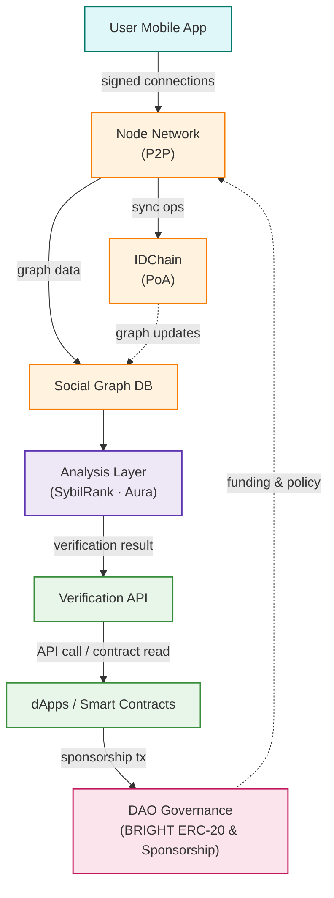

# 📄 BrightID_kr  
- 👤 Author: [20200561 / 전준형](https://github.com/muchwater)
- 📆 Presentation Date: [2025-07-30]  

---

## 1. Overview

- **Project Name**: BrightID  
- **Category**: Proof of Personhood & Identity  
- **Key Technologies / Platforms**: Social Graph Analysis, IDChain (Proof-of-Authority EVM sidechain), Ethereum, IPFS, Aura Anti-Sybil Algorithm  
- **Official Links**:
  - [Website](https://www.brightid.org)
  - [Foundation](https://www.brightid.org/about) 
  - [Contract Address](https://etherscan.io/address/0x5dd57da40e6866c9fcc34f4b6ddc89f1ba740dfe) 
  - [Whitepaper](https://www.brightid.org/whitepaper)
  - [Docs](https://brightid.gitbook.io/brightid) 
  - [GitHub](https://github.com/BrightID) 
  - [X](https://twitter.com/BrightIDProject)
  - [Discord](https://discord.gg/brightid-596752664906432522)

### 📌 Summary  
BrightID는 한 사람이 여러 개의 계정을 사용하는 것을 방지하는 Sybil 공격 문제를 해결하기 위해 설계된 탈중앙화 소셜 아이덴티티 네트워크다. 중앙집중적인 실명 인증 없이도 사용자의 유일성(proof of uniqueness) 을 증명할 수 있도록, BrightID는 개인 간의 연결 관계를 바탕으로 소셜 그래프(social graph) 를 형성하고 이를 분석하여 검증 절차를 수행한다.

해당 프로젝트는 Ethereum 기반의 IDChain을 이용하여 그래프 동기화를 유지하며, 누구나 독립적인 분석 방법을 적용할 수 있도록 오픈소스 분석 도구를 제공한다. 또한, 모바일 앱, seed group, primary group, social recovery 등의 기능을 통해 사용자 경험과 보안성을 동시에 확보하고 있다.

BrightID는 이미 다양한 탈중앙화 애플리케이션(dApps)에 통합되고 있으며, 지속가능한 운영을 위해 사용자 스폰서십 및 DAO 기반 거버넌스를 채택하고 있다. 이를 통해 탈중앙화 환경에서 신뢰 가능한 정체성 기반 인프라를 제공하며, 디지털 공공재로서의 가능성을 보여주고 있다.

---

## 2. Background & Problem Statement

### Problem
디지털 환경에서는 한 사람이 여러 계정(멀티-어카운트) 을 만들어 보상을 중복 수령하거나 투표·에어드롭 등에서 부정 참여하는 Sybil 공격이 빈번하다. BrightID는 social graph를 분석해 사용자가 단 하나의 unique identity만 보유하고 있음을 dApp에 증명하도록 설계되었다. 이를 통해 애플리케이션은 '한 사람 = 한 계정' 원칙을 안전하게 강제할 수 있다.

### Centralized Approach Limitations
기존 중앙화 KYC·OAuth 방식은 개인정보 집중으로 인한 해킹 및 프라이버시 침해 위험, 단일 신뢰기관의 내부 부정·검열 가능성, 국가·플랫폼 경계를 넘는 상호운용성 부족 문제를 가진다.  BrightID는 데이터를 당사자 간에만 공유하고, 검증 로직과 그래프를 탈중앙화·오픈소스로 공개함으로써 이러한 한계를 극복한다.

### AI Relevance
Web3 및 AI 시대에는 decentralized AI infrastructure, AI payment rails, data marketplace 등에서 토큰-기반 인센티브가 작동한다. Sybil 공격이 방치될 경우, AI 콘트리뷰션 보상 시스템이 봇에 의해 왜곡되고, 데이터 크라우드소싱 품질이 저하되며, AI-거버넌스 투표가 조작될 수 있다.

BrightID가 제공하는 Sybil-resistant identity layer는 사람-기반 레이블 품질 향상, 공정한 토큰 분배, 모델 학습 데이터 신뢰성 확보에 필수적이다. 따라서 AI 생태계가 확장될수록 BrightID의 가치는 더욱 커진다.

---

## 3. How It Works

### 🔍 3.1 Project Approach  
BrightID는 신뢰 기반의 소셜 그래프(social graph) 를 구축하고, 이를 분석하여 사용자가 고유한 단일 정체성을 가진 실사용자임을 증명한다. 이는 Section 2에서 정의한 Sybil 공격 문제를 해결하기 위한 핵심 전략이다.

#### Core Idea
핵심 개념은 "신뢰는 중앙이 아닌 사람 간 연결로부터 나온다"는 전제다. BrightID는 사용자가 자신이 아는 사람과 직접 연결(connection) 을 맺고, 이 연결들이 모여 형성된 분산된 소셜 그래프를 기반으로 신뢰도를 계산한다. 각 사용자는 자신의 개인키로 연결을 서명함으로써 신뢰 가능한 관계를 스스로 증명할 수 있으며, 이를 통해 자신의 유일성(proof of uniqueness) 을 다양한 애플리케이션에 제시할 수 있다.

#### Approach & Process

사용자는 BrightID 앱을 통해 다른 사용자와 연결을 생성한다. 이 연결은 암호학적으로 서명된 데이터로 저장되며, 사용자의 local 키로 관리된다. 모든 연결은 IDChain이라 불리는 Ethereum 기반 Proof-of-Authority 블록체인을 통해 동기화된다. 독립적인 검증 노드들은 해당 그래프를 기반으로 Sybil 분석 알고리즘을 실행한다 (예: SybilRank, Aura 등). 분석 결과는 사용자의 유일성 여부를 판단하는 데 사용되며, 애플리케이션은 이 결과를 API로 받아 검증할 수 있다BrightID Whitepaper.

#### Difference from Existing Methods
기존 KYC(신분증 인증), 인증서 기반 시스템, 또는 OAuth(중앙 로그인 서비스)와 달리 BrightID는 다음과 같은 점에서 독창적이다:
- 탈중앙성: 연결 그래프는 중앙서버 없이 노드 간 동기화된다.
- 자기주권성: 사용자는 자신의 정체성과 연결 데이터를 직접 소유한다.
- 프라이버시 보호: 이름·사진 등은 서버에 저장되지 않으며, 오직 연결된 사람과만 공유된다
- 다양한 검증 알고리즘 사용 가능: 각 노드는 자체 알고리즘과 기준을 적용할 수 있어 오픈이노베이션과 다중 검증체계가 가능하다.
---

### 🏗️ 3.2 Architecture  
#### 주요 구성 요소
- User Mobile App
- Signing Keys & Connections
- P2P Node Network
- Social Graph Database
- IDChain (Proof-of-Authority)
- Analysis Layer (SybilRank, Aura)
- Verification API Gateway
- Smart Contracts (BRIGHT ERC-20, Sponsorship)
- dApps / Integrations
- DAO Governance

#### 데이터 흐름 설명
사용자는 Mobile App에서 서로 connection을 생성하고, 각 연결은 개인키로 서명된 후 로컬에 저장된다BrightID Whitepaper. 앱은 이 서명 정보를 P2P Node Network에 전파하며, 모든 노드는 동일한 Social Graph Database를 유지한다. 그래프의 변경 사항은 IDChain이라는 Ethereum 기반 Proof-of-Authority 블록체인을 통해 동기화되어 불변성을 확보한다.

각 노드는 주기적으로 Analysis Layer에서 SybilRank·Aura 등 알고리즘을 실행해 사용자 고유성을 계산한다BrightID Whitepaper. 분석 결과(verified / unverified)는 Verification API Gateway에 캐시되며, 외부 dApps은 REST / GraphQL 호출 또는 Smart Contract 조회를 통해 실시간으로 검증 여부를 확인한다.

dApp이 새 사용자를 온보딩할 때 Sponsorship Contract(BRIGHT ERC-20)로 1 DAI를 지불하면 사용자가 영구적으로 스폰서된다. 이러한 토큰 흐름은 DAO Governance에서 투명하게 관리되어 네트워크 유지·연구·시드그룹 육성에 재투자된다.

#### 아키텍처 다이어그램 

---

### 🎯 3.3 Core Components  
- Social Graph & IDChain
BrightID의 기본 데이터 구조는 사용자 간 signed connection으로 이루어진 Social Graph다. 각 사용자는 자신의 개인키로 연결을 서명하며, 이 그래프는 P2P Node Network에서 공유된다. 그래프 변경 내역은 IDChain이라 불리는 Ethereum 기반 Proof-of-Authority 체인에 트랜잭션으로 기록되어 모든 노드가 동일한 상태를 유지하고 조작 위험을 제거한다BrightID WhitepaperBrightID Whitepaper.

- Analysis Layer
노드들은 Social Graph를 주기적으로 분석하여 사용자의 uniqueness score를 산출한다. 대표 알고리즘으로 SybilRank와 BrightID 팀이 개발한 Aura Anti-Sybil 모델이 있으며, 각 노드는 자체 임계값을 설정해 false positive·false negative 균형을 조정한다BrightID WhitepaperBrightID Whitepaper.

- Mobile App & Social Recovery
모바일 앱은 가입·QR 연결·그룹 관리·키 백업 기능을 제공해 사용자가 손쉽게 네트워크에 참여하도록 설계되었다. 연결 과정에서 상대방의 가입일·상호 연결 수·검증 상태를 실시간으로 확인할 수 있어 Sybil 행위를 초기에 식별한다BrightID WhitepaperBrightID Whitepaper. 개인키 분실 시에는 미리 지정한 두 명과 재연결하여 키를 교체하는 Social Recovery 절차로 안전하게 복구할 수 있다BrightID Whitepaper.

- Sponsorship & BRIGHT Token Economics
한 사용자는 생애 한 번 Sponsorship을 받아야 하며, dApp이 1 DAI를 지불해 사용자를 영구 승인한다. 이 비용은 BRIGHT ERC-20 토큰 회계로 관리되어 BrightID 운영·연구·Seed Group 육성 자금으로 활용된다. Sponsorship 수량은 dApp 순위를 결정해 생태계 참여를 유도하고, 초과 수익은 모든 verified 사용자에게 환급된다BrightID WhitepaperBrightID Whitepaper.

- BrightID Main DAO
BrightID Main DAO는 IDChain 기반 Aragon DAO로 구성되어 개발·리서치·커뮤니티 예산을 집행한다. DAO는 Sponsorship 지표를 바탕으로 dApp·커뮤니티 대표에게 거버넌스 권한을 배분하며, 탈중앙적·투명한 의사결정을 보장한다BrightID Whitepaper.

---

### 🔁 3.4 Workflow Overview  
1. Connection 생성 – 사용자는 Mobile App에서 QR 코드를 교환해 signed connection을 만든다.
2. 그래프 동기화 – 새 연결은 P2P 노드를 통해 전파되고, IDChain 트랜잭션으로 영구 기록된다.
3. 유일성 분석 – 노드들은 Social Graph를 분석하여 uniqueness score를 계산·갱신한다.
4. dApp 검증 – dApp은 Verification API 또는 스마트컨트랙트 조회로 사용자의 “unique” 상태를 확인한다.
5. Sponsorship 결제 – 최초 검증 시 dApp이 1 DAI를 지불해 사용자를 스폰서하고, DAO가 수익을 재투자한다.

---

## 4. Token Economy *(if applicable)*

> *Include this section **only if the project has its own token.***  

- What is the name and type of the token? (e.g., utility, governance, staking)  
- What can the token be used for within the ecosystem?  
- How does the token incentivize key actors (e.g., contributors, validators, users)?
- Is there a burn/mint mechanism, inflation cap, or vesting schedule?  

| Stakeholder | How They Use / Earn the Token |
|-------------|-------------------------------|
| Data Provider | [e.g., earns rewards based on contribution] |
| Model Developer | [e.g., pays tokens to access datasets] |
| Verifier / Node | [e.g., earns tokens by verifying data provenance] |

---

## 5. Project Status & Plan

> *In this section, summarize the current state of the project and its real-world impact (if any).*

- Is the project live? In alpha, beta, or still in development?
- Does it have an active user base or developer community?
- What partnerships, grants, or investments has it received?
- Is it open source? How active is the GitHub repo (if available)?
- Is the token (if any) listed and traded? What is its current market activity?

You don’t have to cover everything — focus on what seems most relevant to evaluating how “real” or impactful the project is right now.

> 📌 *Try to distinguish between hype and actual traction. Just because a project looks good on its website doesn't mean it's being used or adopted.*

---

## 6. User Experience & Hands-on Review *(if applicable)*

> *Try to actually use the project if possible — via a demo, public app, testnet, or simulation.*
> This section should capture your experience **as a user or a developer**, not just as a researcher.

Here are some prompts to help you reflect:

- What features did you explore? 
- What did you do step-by-step?
- Was the onboarding intuitive or confusing? 
- How did you deal with a crypto wallet or tokens?
- What felt different from traditional (non-blockchain) services?
- What worked well? What didn’t?

You can also include:
- Screenshots
- Links to testnet/demo activity
- Errors or bugs you encountered

---

## 7. Why Blockchain

- Why **does this problem specifically require blockchain** to be solved well?  
- What does blockchain enable that traditional solutions cannot?  
- Is decentralization critical in this use case? Why or why not?  

> 📌 *This section should show that blockchain is not just "used," but "necessary."*

---

## 8. Insights & Limitations

### ✅ Key Takeaways
- What did this project do right?  
- What important lessons or patterns can we learn from this project?

### ⚠ Limitations / Open Questions
- What challenges remain? (technical, legal, usability, etc.)  
- Are there any scalability or adoption concerns?

---

## 9. Reflections & Discussion

### 💡 Personal Reflections
- What did you find most interesting or surprising?  
- How has your understanding of AI/blockchain changed after studying this?

### ❓ Discussion Questions
- Thought-provoking question to ask during class
- You should facilitate a small group discussion based on these questions.  
- Optional: comparison to other projects in this space

---

## 10. Insight from others

After each presentation in class, we will form small groups for each case for discussion. At that time, please discuss with your group the questions posed in Section 9, and write any key points or insights from your discussion group here.

---

## 11. References

- [Articles, blog posts, or academic papers]  
- [Related projects or comparisons]
